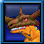
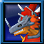
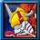
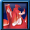
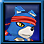
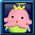

# 常见数码兽百科

> 注：市价仅代表个人意见。

## 1. 初始数码兽

<table>
    <tr>
        <th>图标</th>
        <th>名称（中/英）</th>
        <th>评价</th>
        <th>获取途径</th>
<tr/>
    <tr>
        <td></td>
        <td><b>亚古兽</b>/大地暴龙兽/进升暴龙兽/闪光暴龙兽/闪光暴龙兽爆裂形态</td>
        <td rowspan="2">烂中烂</td>
        <td rowspan="2">只有初始新号选择获得</td>
    </tr>
    <tr>
        <td></td>
        <td>Agumon/ GeoGreymon/ RizeGreymon/ ShineGreymon/ ShineGreymon(Burst_Mode)</td>
    </tr>
    <tr>
        <td></td>
        <td><b>伽奥兽</b>/</td>
        <td rowspan="2">烂中烂</td>
        <td rowspan="2">只有初始新号选择获得</td>
    </tr>
    <tr>
        <td></td>
        <td></td>
    </tr>
    <tr>
        <td></td>
        <td><b>拉拉兽</b>/</td>
        <td rowspan="2">烂中烂</td>
        <td rowspan="2">只有初始新号选择获得</td>
    </tr>
    <tr>
        <td></td>
        <td></td>
    </tr>

</table>

## 2. 联展进化数码兽

## 3. X抗体数码兽

## 4. 战魂数码兽

## 5. 合体进化大作战数码兽

## 6. 特殊进化数码兽

## 7. 活动/特殊数码兽

