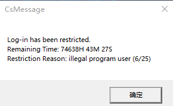
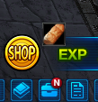
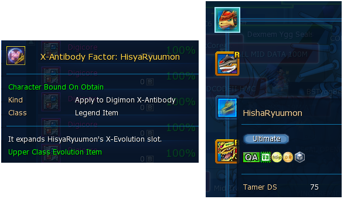
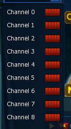
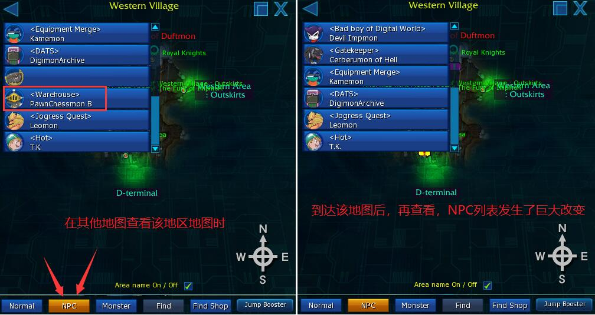
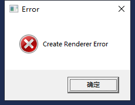

# 常见问题与bug百科

这里记录了游戏中常见的异常问题，有些包含解决方法。

我大多数问题还没写完，有时间写哈。

## 1. 常见问题与解答

### 1.1 游戏/客户端相关

Q1： 注册邮箱可以用网易/QQ邮箱吗？

Q2：steam服和官服有什么区别？

Q3：被举报会封号吗？被录屏会封号吗？

Q4：为什么截图不能露出自己的ID/名字/昵称/姓名/人物/驯兽师？

Q5：The server is undergoing ispection or updates.游戏什么时候维护？

Q6：服务器列表找不到奥米加区了

Q7：登录游戏CsMessage Log-in has been restricted. Remaining Time:

阿这。。。

恭喜你被封号。转生吧没救了。

Q8：登录游戏Unknown System Error occured, please contact Digimon Masters Online support team with My Q&A section

多半只是网络问题，检查一下网络。重启下电脑。

### 1.2 数码兽相关

Q1：我不能合体进化了

没有合体芯片，或者芯片已过期。重新装上合体芯片。

Q2：为什么不用中卡mid data孵化数码兽？

因为中卡过于昂贵。1张中卡需要[100张同类型低卡+5个数码核+约49M]进行合成。如果说1张龙低卡需要3M，那1张中卡保底就300M，通常价格在400M以上。而一次孵化假设需要10张卡，那么使用中卡进行孵化，点一次就需要4T，而且成功率依旧很低。

所以很少有人使用中卡进行孵化，只有那些平常无法获得的，比如有人获得了一个3阶的哈克兽蛋，但是低卡最多只能孵化到3阶，后续就只能用中卡冲。

Q3：如何获得SSS+数码兽？

如何白嫖SSS+呢？SSS+相信大家都很熟悉，但是怎么白嫖SSS+呢，下面就让吧主带大家一起了解吧。

SSS+，其实就是数码兽的一个评级，大家可能会很惊讶怎么能白嫖到SSS+呢？但事实就是这样，吧主也感到非常惊讶。

这就是怎么白嫖SSS+的事了，群友有什么白嫖SSS+的心得，欢迎在群里一起讨论哦！

Q4：aox，aoa是什么？

Q5：为什么有人的数码兽体型特别大/特别小？

Q6：如何解锁宠物的坐骑？如何获得坐骑道具？

Q7：为什么数码兽超越时的材料要用烂泥兽？

因为烂泥兽是官方设定的，具有最高超越经验的数码兽。其他数码兽也能当做超越素材，但是经验少，充能次数多，导致使用的超越卡数量多，不划算。而烂泥兽本身也经常作为活动、日常的奖励，耐心点总能得到的。

关于超越的更多资料，请阅读[数码兽超越](../3.各类强化系统/数码兽超越.md)。

Q8：新手初始数码兽（亚古兽/伽奥兽/拉拉兽）的最终进化形态爆裂模式如何解锁？

Q9：改S是什么？如何获得电光暴龙兽和偃月加鲁鲁兽？

Q10：如何练级？在哪里练级？练级路线推荐

Q11：混沌兽是哪只狮子兽合体？

### 1.3 道具/地摊/装备相关

Q1：哪几个增益BUFF/经验加成exp可以互相独立使用？

没有合体芯片，或者芯片已过期。重新装上合体芯片。

Q2：如何使用MC卡？（Monster Card）

Q3：强化克隆球（SABCD）怎么获得？

Q4：如何做徽章暴龙机？需要多久？

Q5：强化备份怎么获得？

Q6：有时限的道具（例如衣服）如何延长时间？

Q7：如何才能自动吸取地上的掉落物？有卖磁铁/磁卡的礼包吗？

Q8：如何获得中级孵化卡？/如何获得龙中？mid data

基地的分子兽，[100张龙低卡+5个数码核+约49M]=1张龙中卡。其他类型同理。

Q9：开蓝卡的open怎么获得？

Q10：孵蛋的备份HBU5怎么获得？

Q11：球衣如何获得？球衣过期了怎么办？

Q12：地摊摆的30多t的手环，跟做皇骑任务给的手环有什么区别吗？

Q13：如何搜索地摊的关键字？XX道具的关键字是什么？搜什么关键字？

Q14：强化克隆球之间有什么不同吗？

Q15：商城卖的蛋都是可以低卡上的吗？商城卖的蛋和普通的蛋有什么区别？

Q16：一个open可以开多少张蓝卡？为什么要50张蓝卡再用open？

Q17：怎么获得地摊？获得商店？我想摆地摊/卖东西。

Q18：在哪里买药/食物？如何获得鸡腿？

Q19：买什么首饰/耳环/项链/手环/戒指？如何洗首饰的属性？

### 1.4 地图/副本相关

Q1：为什么副本里没有BOSS？

组团进副本打完后，需要所有人都退出，才能刷新副本状态。若有一人留在副本内，其他人从外部再进入该副本，看到的都是打完的状态。打完本后，所有人都退出副本，重新进入。或者粗暴点，直接解散队伍重新组。

Q2：为什么每天都要给竞技场投币？

因为竞技场每天头80币，可以获得免费的一套增益buff和若干奖励，这些都是新手期非常需要的。日积月累后，将形成非常客观的资产哦。

Q3：为什么要每天接顽固任务，周日才刷？不同日期刷的材料不一样吗？

Q4：为什么竞技场jjc周排名我这么靠前？这游戏没活人吗？

Q5：为什么要每天领门票？要领哪些门票？

Q6：困难竞技场jjc是什么？什么时候可以打？收益高多少？

Q7：无法进入地图传送点

一直点地图的传送点，在门前，却不能过图，有的是因为坐骑太大了，卡头或卡身子了，体大弱门。取消坐骑即可。

Q8：如何购买竞技场jjc服务？如何让别人带我过jjc？

Q9：简单的竞技场jjc有多少层？

### 1.5 未分类

Q1：奶妈是什么？怎么做奶？哪些数码兽适合做奶？为什么装甲体/合体不能做奶？

奶妈通常指，没有明显战斗力，通过IC辅助技能，为队员不断加血的一种职业。

如何成为奶妈，请阅读[青春奶妈修炼手册](../2.新手指导/附录C：青春奶妈修炼手册.md)。

Q2：如何扩充背包和仓库？

Q3：怎么赚钱？如何赚取游戏币？

Q4：每日任务什么时候才刷新？

每天晚上11点（北京时间）。

Q5：什么是追BOSS？

Q6：图鉴/成就/称号解锁的BUFF可以叠加吗？

## 2. 游戏BUG与自救方法

### B1：使用背包扩容和仓库扩容无效

在使用扩容道具后，道具也进入了短暂的冷却，但道具数量没有减少，而且背包和仓库也没有得到扩容。

解决方法：重启游戏。

###  B2：经验加成BUFF 193046H错误

经验加成栏中，有一项的剩余时间显示存在异常，通常是该增幅效果持续时间已过，且无法使用同种buff进行叠加了，很可能是溢出错误。

解决方法：换线。

###  B3：掉落物获取图标错误

获得战利品时，游戏右下角会有道具图标进入背包的短暂动画。但是该道具图标很可能与实际获得的道具不符，动画展示的图标是有误的。

图示为在邪龙图，获得绑定鸡腿时，右下角提示获得面包的显示bug。

###  B4：这是我最后的波纹了

自己的数码兽在战斗中生命归零时，由于仍处在播放其战斗动画中，所以没有立即死亡，也没有跳出死亡弹窗。

在这个瞬间，如果玩家自己使用回复道具抬血线，或者队友给予其治疗技能，有可能将自己的宠物奶回来并继续战斗，也有可能会跳出死亡弹窗进而死亡，也有可能会跳出死亡弹窗的同时宠又开始了下一次行动并给了敌方一拳然后死亡。。。

在对战BOSS时，击败BOSS后会显示出所有人的输出值统计。而数码兽战败时，其输出值将归零。对于上面提到的第三种情况，假如在组团副本中，我们会发现，主C不幸死亡了，但是我们又给他奶了，主C立刻又打了BOSS一拳，然后主C死了，其他人把BOSS杀了。最后结束的输出统计里，那个主C的伤害累积只有最后那一拳的伤害，说明主C在死亡后，伤害累积归零，但仍然给予了BOSS一拳。造成这个情况的原因，可能是客户端和服务器端对宠物死亡的判定机制和时间不同吧。

> 注：标题“这是我最后的波纹了”源自《JOJO的奇妙冒险》中西撒死亡前的台词。

###  B5：游戏中其他人，野怪都不动了，只有自己能动

非网络问题，网络连接顺畅，只是其他人都不动了，只有自己能走。而且自己也无法攻击其他数码兽，无法换线，无法脱离战斗状态。

解决方法：log out，从游戏中切入到选择服务器界面，重进即可。

### B6：在竞技场中，即使人物的DS空了，也能进行进化退化来奶队友

以前用弯刀挂自动奶时，即使人物蓝条DS空了，也能正常奶下去。人物DS不足时应该是不能进化的。这反而是一个良性BUG。

> 该BUG于2022.07.09后，疑似被修复。

### B7：好友列表里给其他人写的备注Memo，在重进游戏后就消失了

官方的问题，做的虚假的功能，实际上服务器端根本没存你写的东西。所以说这个游戏的社交系统形同虚设。无解。

### B8：飞车龙兽HisyaRyumon的图鉴名称写错了

王龙兽的完全体，飞车龙兽**HisyaRyumon**，在其进化路线中，被官方错误地写为了**HishaRyuumon**，甚至其X抗体因子解锁道具，也被误写为了**HisyaRyuumon**。

作为龙胎真的是毫无尊严呢。

### B9：无法对队友使用IC技能：治愈能力。

辅助型IC技能，治愈能力，可以对自己或一个队友进行治疗。但是有时候会存在无法使用的bug，导致队友错失最佳治愈时机而死亡进而副本没打过。

解决办法：据说连续进化/退化2次，可解决该问题。但2次进化都快20秒了，黄花菜都凉了。可以尝试更换没有bug的群回技能，治愈之手，但其单体治疗量不如治愈能力。

### B10：多个系统图标

这个游戏，启动时会在右下角获得一个系统图标，蓝色底的X字。但是这个游戏偶尔会频繁地掉线，在电脑没反应过来时，就会出现很多个很多个X，十分壮观。

解决办法：你把鼠标移动到靠近这些图标的位置，他们就会逐个消失。实在不行重启下电脑吧。

### B11：所有频道都红

官方有时候会推出免费获得X因子宝箱的活动，例如ox因子宝箱。但是其出货率只有0.01%，这样也挡不住玩家们疯狂开小号试图白嫖的冲动，造成了游戏十分火爆的假象。官方也很有可能暗改了爆率，实际上真正开出来的人，最终出货的可能都不够5个。

解决办法：不信谣不传谣，中奖的肯定不是你。他们都是小号，洗洗睡吧。

### B12：野怪掉落非自己属性的数码蛋。

在地图In Forest of the Beginning，\<Leader\>Betamon是水系，但是会掉落兽系的DigiEgg。

> 注：已经在2022.06.21更新后修复，现在则会掉落水系的DigiEgg。

### B13：地图NPC不存在的bug

在大地图中看到的NPC，很有可能不存在。举个例子是，西部的初始地Western Village，打开地图查看NPC列表，发现是有一个仓库管理员黑棋兽的（但是正常应该是白棋兽管仓库）。

当你真的到达该地图后，重新查看NPC列表，会发现根本不存在黑棋兽。

### B14：港服bug：每日任务可以无限重置

存在于港服DMO，据说是经过一个大图，地图的每日任务都会进行重置，进而可以刷取无限的顽固兽副本门票。

该bug第二天被修复，封禁了一大批账号，引发了港服的退坑潮。时间还未进行考证。

### B15：港服bug：无限的角龙兽boss

在海滨的平顶山上，有一只角龙兽BOSS，它每30分钟刷新一次。港服DMO出了一次活动，让该BOSS可以1分钟刷新一次，并且港服的该BOSS是可以掉落备份的。

但是活动结束后，并没有被修改回来，玩家还可以继续刷角龙兽。之后才被修复。

### B16：GDMO使用CE获得终千

暂无记录

### B17：双成就BUFF

数码兽头像右边出现了两个BUFF，但是这个成就奖杯BUFF只能激活一个。

实际上是显示BUG，两个奖杯都显示的同一个效果。

### B18：CreateRendererError

启动游戏时报错。

解决办法：尝试重启，不知道好不好使。

### B19：图鉴BUFF页面，数码兽全部显示为黑色未解锁

是因为，如果你已经激活了一个图鉴BUFF，则所有其他的数码兽全部都会变成黑色。你取消了那个BUFF，解锁的数码兽才会正常显示出来。

