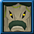

# 道具获取百科

> 注：市价仅代表个人意见。

## 1. 数码蛋

| 图标 | 名称 | 用途 | 获取途径及关键字 | 市价 |
| :--: | ---- | ---- | --------------- | :--: |
|      |      |      |                 |      |
|      |      |      |                 |      |

注：关于具体哪个数码兽要打哪个地图获得其蓝蛋，请查看[常见数码兽百科](常见数码兽百科.md)。

## 2. Data/孵化卡/超越卡

## 3. 衣服/首饰

## 4. 蓝卡

> 注：蓝卡在游戏中的图标均为。为了玩家方便查看，我们将以对应数码兽的头像来代替蓝卡的图标。

|                      图标                       |            名称             |      用途      |                                   【关键字】及获取途径                                   |          市价           |
| :--------------------------------------------: | --------------------------- | ------------- | -------------------------------------------------------------------------------------- | ----------------------- |
|  | 开卡器（Seal Opener）        | 开最多50张蓝卡 | 【open op opener】氪金。地摊买。                                                         | 700  |
|  | 锁卡器（Seal Closer）        | 锁最多50张蓝卡 | 【close closer】氪金。地摊买。                                                           | <150 |
|      | 祖利兽蓝卡（Cherrymon Seal） | +250AT        | 【AT seal】刷野怪（Silver Lake、Lost Historic Site、Server Continent Canyon）。删MC5卡。 | 3    |
|                                                |                             |               |                                                                                        |                         |

## 5. 食物/药物

## 6. X抗体/X因子

## 7. 其他

## 8. 任务道具

|                               图标                               |          名称           |                                             用途                                              | 关键字及获取途径 | 市价 |
| :-------------------------------------------------------------: | ---------------------- | --------------------------------------------------------------------------------------------- | --------------- | :--: |
|  | Information of Kunemon | 位于Yokohama Village的NPC Mary的新手任务[Attached Breeding Ground Case]所要求的战利品。无用可扔。 |                 |      |
|              | Cold Water             | 位于Yokohama Village的NPC Vending Machine所售卖的新手任务[Suspicious Victory - 2]道具。无用可扔。 |                 |      |
|                                                                 |                        |                                                                                               |                 |      |
|                                                                 |                        |                                                                                               |                 |      |

