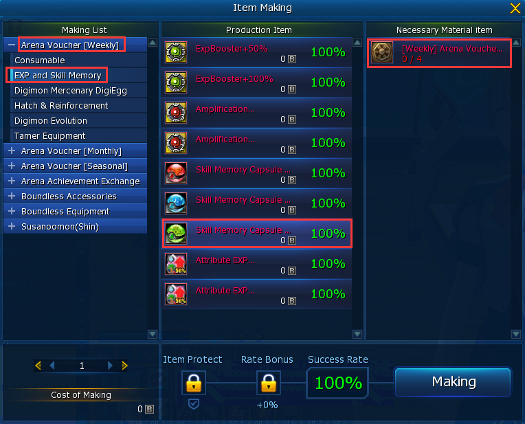
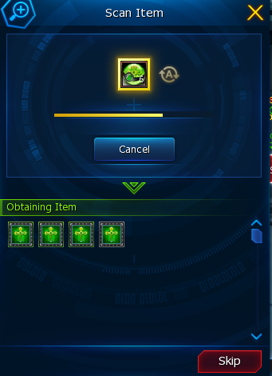
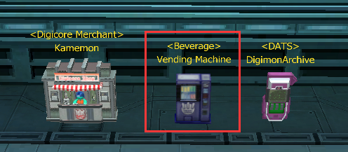
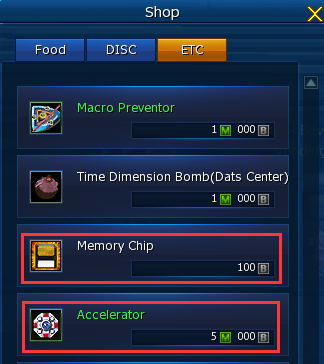
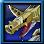
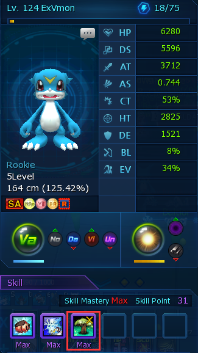
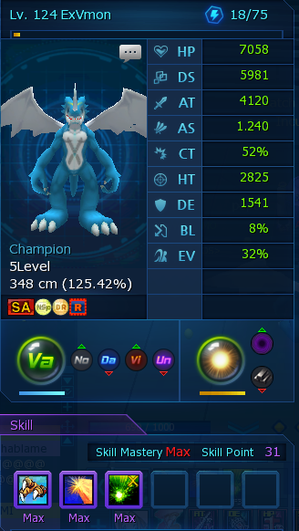

## 【附录C：青春奶妈修炼手册】前言

> 注：此版非正式发行版，后续还需要修改。

## 1. 什么是奶妈？

在其他网游中打副本时，人们习惯地将各个职业/站位分为三个大类：**坦克**、**输出**和**辅助**。而**奶妈**则特指一类为其他玩家加血的辅助职业。

在DMO中，我们通常将职业分为两类：输出和奶妈。

 - **输出**：副本中BOSS的仇恨集中在输出最高的玩家身上，因此在DMO中的坦克和输出是同一个位置，由一名玩家承担，这个位置也称为**主C**。其他输出稍逊的玩家在协同打伤害的同时需要分摊BOSS的范围伤害，但生存压力比主C轻，这个位置一般就称为**C**。而所有进行打伤害的职位，玩家通常称其为**打手hitter**，不论其输出能力的高低。
 - **奶妈**：因为DMO中的常规恢复手段就只有吃药，而药的CD通常为10s。如果血线抬不上来，即使输出再高，也很难打过副本。而**奶妈**则是通过治疗技能来为队友抬血线的一类人，3C+1奶的配置也是过竞技场的有效配置。

> 人们常说的缩写C，其英文全名是Carry，指能主导局势的人。在DMO也泛指进行输出的打手。

奶妈既可以指身为奶妈职业的玩家，也可以指专职进行治疗的数码兽。为避免歧义，后文中出现的奶/奶妈，没有特殊说明时，均特指那只进行治疗的数码兽。

### 1.1 成为奶妈的条件

从养成路线来说，任何人都可以成为修炼为奶妈，而奶妈玩家也可以随时切换数码兽变为C。所以普通玩家完全可以养一只奶妈数码兽，平常出门打本就用C，特定情况时把奶妈拿出来进行组队配合。

理论上，数码兽成为奶妈的条件就是：数码兽的等级超过70级，可以学习高级High/Lv.3的IC技能即可。所以说当奶妈几乎没有门槛。

如果你是萌新，还不确定是否想要成为奶妈，我推荐你先将**周币**存下来，别着急换骑乘道具啥的。等一两周后决定后，再看看是不是要当奶妈。

### 1.2 铁打的奶妈，流水的C

随着游戏的版本迭代，出现更强的数码兽和更难的副本是不可避免的，曾经的顶尖数码兽日后也可能变为仓管。这个变化非常容易体现在竞技场中，玩家手中的C不断地更换，而唯独不变的则是永远的那个奶妈。

奶妈数码兽一旦成型，将**非常非常保值**：一是因为DMO中几乎不存在辅助数码兽，新出的数码兽都在争数值高低，也就是说在C上卷的严重，而奶妈这块领域几乎不存在竞争。二是因为奶妈成型后，不存在时限性，一次付出打造，终身受益，随叫随到，并且奶妈每次出勤的成本非常非常低廉，和C在DS上所付出的蓝药相比少得太多了。

所以在版本更替过程中，就像其他的C在为奶妈玩家打工，C不断地变换，而奶妈是永恒不变的，**奶妈才是人上人**！

 - 成为奶妈前：“你入坑也挺久了，以后竞技场该自力更生了。”
 - 成为奶妈后：“让奶妈先进！”

因此很多老玩家都推荐萌新初期就修炼为奶妈。选择成为奶妈，你的竞技场需求度将得到保证，你不需要和其他老玩家比输出，而是会有其他玩家来组你，因为你是奶妈。

成为奶妈的成本也是可以接受的，后文将介绍到。最后，如果你是究极氪金玩家，可以非常迅速地进入竞技场打手行列中，那你确实不需要做奶妈这一步骤。

## 2. IC技能入门

在进一步介绍奶妈之前，我们需要预习一下**IC技能**。IC技/IC技能，Memory Skills，是一种可以让数码兽学习新的特定技能的特殊物品，通常也指数码兽已经学得的IC技。

我们只关注对奶妈有益的内容，即**辅助型IC技能**。

|                             图标                             |             技能名称             |           技能效果（低级Low/中级Mid/高级High/最高级Highest）           | 冷却时间 | 持续时间 |
| :---------------------------------------------------------: | -------------------------------- | ------------------------------------------------------------------- | :------: | :------: |
|  | **再生能力**Regenerative Ability | 指定自己或一只队友的数码兽恢复20%/35%/50%/70%的HP。                     |   30s    |    -     |
|   | **治愈之手**The Hand of Healing  | 全队数码兽恢复15%/20%/25%/30%的HP。                                   |   30s    |    -     |
|      | **生命之树**The Tree of Life     | 全队数码兽的最大HP和最大DS提升15%/30%/50%/65%。                        |    3s    |   300s   |
|              | **疾走**Speeding                 | 全队的移动速度提升10%/15%/20%/25%。                                   |   90s    |   30s    |
|       | **矫健的身手**Quick Movements    | 全队数码兽的闪避率提升20%/35%/50%/65%。                                |   120s   |   30s    |
|         | **九死一生**Narrow Escape        | 指定自己或一只队友的数码兽，当其HP低于30%时，恢复其30%/50%/70%/85%的HP。 |   60s    |   10s    |

奶妈只关注上面提到的前三个技能，即：再生能力、治愈之手和生命之树，根据技能等级不同俗称**高单/单回**、**高群/群回**和**高树**。

关于IC技能的更多知识，可以前往[【3.各类强化系统】-【IC技】](../3.各类强化系统/IC技.md)进行学习。

## 3. 奶妈技能所需的材料

那么，如何获得上文提到的辅助型IC技能呢？需要从**IC技能球[辅助]**（Skill Memory Capsule [Support]）中获得。一个数码兽的多个进化形态都可以学习不同的**IC技能**，所以一个合适的奶妈需要获得多个辅助IC技能才行，只有一个技能的奶妈纯属毒瘤。

来到基地正门右手边的竞技场外，找到竞技场的奖品兑换人**Mary**。

每4个**周币**可以兑换1个球。

拿到球后，进行扫描，就可以随机获得**IC技能道具**了，均是不可交易的。

最高级的技能只能通过商城氪金购买**最高级IC技能球**（Highest Skill Memory Capsule）才能获得，所以普通奶妈的最终目标是IC技能等级都达到**高级**。辅助球总共有3级×6种=18种技能，有5.6%的几率能获得你想要的那一个。一个合格的奶妈应该具备诸如以下的配置：

| 序号 |                                                                 技能搭配                                                                  |             评价              |
| ---- | ---------------------------------------------------------------------------------------------------------------------------------------- | ---------------------------- |
| 1    | 再生能力xN + 生命之树x1 | 常规单回奶妈，适合C数量≤2的副本 |
| 2    | 治愈之手xN + 生命之树x1  | 常规群回奶妈，适合C数量≥2的副本 |
| 3    | 再生能力xN                                                                    | 极限单回奶妈                   |
| 4    | 治愈之手xN                                                                     | 极限群回奶妈                   |

> N通常等于4，极限时可以等于5或6。

多余的IC技能，低级的可以全部扔掉或者是塞给其他宠玩，中级的看情况保留，高级的可以囤着。使用IC技能道具，就可以让当前数码兽的当前进化形态学习该技能。初阶奶妈也可以塞入几个低级或中级的技能，待以后抽到高级的技能后删除原技能再更换为新技能即可。

释放IC技能需要消耗背包中的**记忆芯片**（Memory Chip），你可以在基地的贩卖机处购买它。如果你奶妈的进化需要消耗**加速器**（Accelerator），也可以进行购买。

 

> 注：记忆芯片本身就很便宜，地摊也没人卖，没利润。而加速器在商店卖5，在地摊也许能找到2的价格哦！

## 4. 合适的奶妈数码兽

再生能力和治愈之手是有冷却时间的，CD为30s。而多个进化型之间的CD是独立计算的，因此通过不断地进化退化，就能达成“一直在奶”。所以，进化路线越长，数码兽成为奶妈的潜质就越高！我们推荐以下的数码兽作为奶妈，稍后分析其特点：

| 序号 |                 数码兽                  |                                                                                                                                                 进化路线                                                                                                                                                 | 最长单向路线长度 | 推荐指数  |
| ---- | --------------------------------------- | ------------------------------------------------------------------------------------------------------------------------------------------------------------------------------------------------------------------------------------------------------------------------------------------------------- | :-------------: | -------- |
| 1    | V仔兽    |                    |        6        | ⭐⭐⭐ |
| 2    | 比特兽  |                                                                             |        6        | ⭐      |
| 3    | 龙胎兽 |  |        7        | ⭐      |
| 4    | 小狗兽  |  ；                                                             |        5        | ⭐⭐    |

1. V仔兽（ExVeemon）：是具有**最长的最低成本进化开销**的数码兽，也是我们最推荐的。从V仔兽一直进化到帝皇龙甲兽战斗模式.png)，总共含5个形态，进化只需要DS，萌新做奶妈就可以只做到这里为止。如果想要再更强更奶，可以后期再扩展到圣骑士.png)，进化开销增多了加速器道具。
2. 比特兽（Betamon）：是具有**X进化**的典型数码兽。常规数码兽的单条路线形态个数是5，因为多了一个X进化形态，所以变为非常稀少的6，成为优质奶妈的候选。但是因为最后的十亿海龙兽X，需要X抗体能量条才能进化，因此进化开销较大，并且海龙兽的X抗体因子也不好获得。
3. 龙胎兽（Ryudamon）：具有**废件**特质的典型数码兽。虽然其进化路线长达7，但从阿尔法兽王龙剑开始，其IC技能都只接受合体技，价格昂贵且效果稍弱。而且阿尔法兽王龙剑觉醒更是氪金大佬的选择，所以进化路线长，也不一定适合萌新拿来做奶妈。因为龙骀兽通常是萌新入坑时就要孵化的数码兽，被用作是多路兽合体进化的废件数码兽，常备于携带栏中，所以也可以拿来做奶妈，发挥它余生的作用。
4. 小狗兽（Salamon）：其是具有**控制技能**的典型数码兽。小狗兽进化为圣龙兽也是很常规的长度4，进化为神圣天女兽需要加速器道具，开销稍多，因此小狗兽本质上不是一个优秀奶妈选择。但是其装甲进化的山羊兽，具有全游戏唯一的控制效果，最长可控制敌人18秒，简直离大谱。

上面只是一些典型的奶妈数码兽，你也可以根据喜好选择自己的奶妈数码兽，例如选择真的“有奶”的狐狸兽。。。但是要注意以下两条建议：

 - 少选择带有合体/联展进化的数码兽。因为自合体后，只能学习IC技能方块所开出的技能，价格昂贵且效果很弱，奶量少。这不意味着合体IC技一无是处，打本时若没有奶妈，C经常需要自学治疗技能。
 - 少选择装甲体数码兽。比较一下两条进化路线：[成长期->装甲体->成长期->成熟期……] 和 [成长期->成熟期……]。因为治愈之手的CD有30s，等于说，为了走装甲体这条线，我们浪费了至少1个进化的时间，而队友很可能在这个空隙死亡。除非你是手动奶妈，或许有更充足的时间来分配到装甲体上，否则尽量少考虑装甲体路线。

## 5. 真正成长为奶妈

准备好IC技能道具，以V仔兽为例，想要将其修炼为常规群回奶妈，我们准备了至少4个高群（治愈之手高级）和1个高树（生命之树高级）。

我们首先将V仔兽出战，打开数码兽详情页，然后使用背包中的IC技能道具-生命之树，即可让V仔兽学会生命之树，将该技能拖至于F3。

之后进化为V仔兽EX，再学习治愈之手，将治愈之手放置于F3，再进化为机甲龙兽以此类推。最终，你可以选择到帝皇龙甲兽战士形态为止，这样是4奶+1树。若是选择扩展到白帝形态，则是极限的5奶+1树，这也意味着进化需要的加速器将增大你的支出。

为什么说5奶+1树是“极限”，是因为4奶+1树，在脚本无进化CD奶的情况下，会有一段约5s的冷却空窗期，而5奶+1树则可以避免，形成几乎无死角的奶。如果你是手动奶，就不存在极不极限的问题了，4奶+1树就完全够用，如果一个副本你手动奶都奶不回来，要么是奶妈技能等级太差，要么是C太烂。

至于高树是放在成长期V仔兽身上好还是白帝身上好，各有利弊：

 - 放在V仔兽上：如果发现高树持续时间快结束了，可以随时切换回成长期补充高树。
 - 放在白帝上：需要一段时间就回来手动进化为白帝，手动释放高树后再切回成长期的V仔兽。

## 6. 奶妈的操作

奶妈请记住，**先去基地的贩卖机买芯片**，常备999个。

然后我们和队友一起进竞技场，奶妈先进（人上人！）。因为最后进入竞技场的玩家优先获得仇恨，所以一般让主C最后进。（老手打竞技场时，会默认让主C切一次宠。切宠后将重新获得仇恨，以保证其他玩家的安全，也不用顾及是否让奶妈和萌新提前进）

之后队友开打，我们就站在旁边看。普通竞技场有40层关卡，前面都是很轻松的，可以不奶，也可以偷懒直接在这里开脚本奶。

等队友开始吃力，血线下降时，就可以开始奶了。快，V仔兽释放生命之树！紧接着进化到V仔兽EX，释放治愈之手！

然后等待进化CD，紧接着进化到机甲龙兽，再观察队友血线，以此类推。

直到进化到帝皇龙甲兽战士形态，再根据自身情况，是否扩展白帝。

## 7. 战后总结

如果情况顺利，仅凭一个V仔兽这种上个世纪的数码兽，我们就能获得：

|    配置    |                      道具                       | 数量  |         总价值         |
| --------- | ----------------------------------------------- | ---- | --------------------- |
| 一场竞技场 |  | 1072 | 1.5 |
| 两场竞技场 |  | 2144 | 3   |

然后一场20分钟的竞技场之旅，我们将失去：

<table>
    <tr>
        <th>配置</th>
        <th>主要消耗道具</th>
        <th>数量</th>
        <th>可选其他道具</th>
        <th>总价值</th>
        <th>总价值+加速器</th>
        <th>总价值+地摊加速器</th>
<tr/>
    <tr>
        <td>手动奶</td>
        <td rowspan="3">
</td>
        <td>100+</td>
        <td rowspan="3">
  </td>
        <td>10</td>
        <td>54.12</td>
        <td>31.65</td>
    </tr>
    <tr>
        <td>脚本自动奶</td>
        <td>200+</td>
        <td>20</td>
        <td>93.53</td>
        <td>49.41</td>
    </tr>
    <tr>
        <td>无进化CD脚本自动奶</td>
        <td>500+</td>
        <td>50</td>
        <td>211.76</td>
        <td>114.70</td>
    </tr>
</table>

> 注：地摊加速器指加速器单价以2从地摊收的。以上价值均为估算，仅供参考。

## 8. 后话

### 8.1 奶妈的敌人

1. 掉线。
2. 队友太菜，打得太久。
3. 芯片不够。
4. 忘记看驯兽师蓝量，导致无法进化。
5. 单回技能再生能力有时会出BUG，导致无法使用。据说需要进化2个进化型才能解除该BUG。

### 8.2 奶妈的未来发展

1. 有了奶妈后，我们就可以有稳定的竞技场收入了，不需要慌张地花费更多心思在怎么打得过竞技场了，而是可以缓慢地培养提升。
2. 通常的竞技场奶妈都是高树+群回的配置。但是群回的奶量也就那样，后续可以再养成一只高树+单回的奶妈。
3. 奶妈的技能等级一定要追求到高级，中级和低级等级的奶妈都是不称职的。

