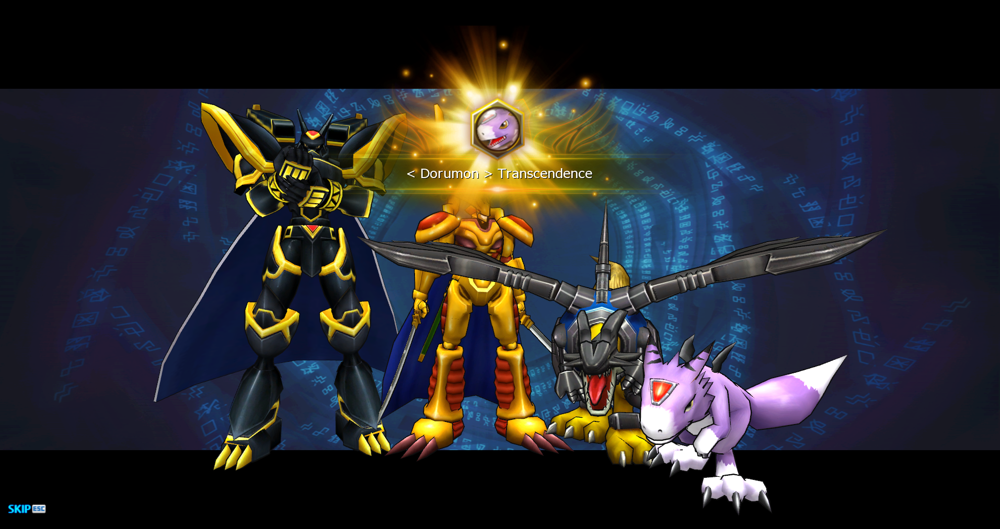

## 【附录F：强化爱宠，超它！】前言

## 1. 强化宠物

## 2. 超越宠物

现在，我们应该已经养成了一个十分强大的数码兽，它将帮助我们继续推进主线剧情。如果你认为它仍十分优秀，并且潜力巨大，那么就可以考虑超它！

超越后的数码兽，将获得如下优势：

 - 数码兽的体型上限从130%提升到了140%。
 - 解锁了[数码兽强化](3.各类强化系统/数码兽强化.md)的HP选项

### 2.1 数码兽的超越条件

首先确认一下你的主宠是否满足以下条件：

 - 孵化时的阶级是5阶。不是5阶的宠就删了吧。
 - 体型必须大于等于125%。不会改变体型的同学请阅读[【各类强化系统】-【数码兽体型】](../3.各类强化系统/数码兽体型.md)。
 - 数码兽的等级达到100级及以上。等级不够？去练级啊！

### 2.2 准备超越所需的素材

假如我们要超越一只多路兽，多路兽是**兽型数码兽**（而不是龙型），是Beast类型，则需要准备的素材如下：

|                                          图示                                          |                         名称                          | 数量 |                 说明                 |
| :-----------------------------------------------------------------------------------: | ---------------------------------------------------- | :--: | ------------------------------------ |
|                                                 | 任意4阶的素材数码宠                                    |  1   | 从仓库里挑一只或直接孵化一只4阶杂鱼。    |
|                                                  | 4阶烂泥兽                                             |  1   | 超级经验宝宝。                         |
|                                                  | 5阶烂泥兽                                             |  1   | 超级无敌经验宝宝。                     |
|  | 兽低超越卡，Low Class Beast Transcendence ConvertChip |  1   | 因为多路兽是兽型，所以选择兽型超越卡。   |
|  | 兽中超越卡，Mid Class Beast Transcendence ConvertChip |  2   | 中级超越卡在图标上和低级超越卡几乎一样。 |
|                                                                    | 游戏币，T                                             |  5   | 超越是要花钱的，5T。                   |
|                          | ygg，世界树的果实，Fruit of Yggdrasil                  | 若干 | 将体型随机修改为125%-140%。            |
|                        | 体内平衡的果实， Fruit of Homeostasis                  | 若干 | 将体型随机修改为128%-140%。            |

上面提到的超越卡，一共有11种，与数码兽的分类是相同的：。

> 注：超越时，要选择合适的超越卡，其种类应该和要即将进行超越的数码兽（而不是即将成为经验宝宝的数码兽）的种类相同。如果你超越的是龙型数码兽亚古兽，则你需要准备的超越卡都应该是龙型超越卡，而不是上面提到的兽型超越卡。

### 2.3 进入超越的菜单

准备好上述素材后，即可前往Digimon Archive机器进行超越。

切换到超越的菜单里。

### 2.4 进行超越

1. 将想要进行超越的**多路兽**放置于随身携带栏①中。然后左键点击它，它就出现在了③中。

2. 之后从右侧的仓库②中，不断地右键点击想要被吸收的素材数码兽，选中的数码兽会出现在④中。此时进度条⑤会显示出这些数码兽可以给予的经验值。同时⑥也会给出所需要的超越卡的种类和数量，数量和放入④中的素材数码兽数量相同。

3. 我们只需要将前面准备的1只4阶任意宠放入，并点击⑦**常规充能（Regular Charge）**，这将消耗我们准备的1张**兽低超越卡**。

4. 之后将4阶和5阶烂泥兽放入，点击⑧**超级充能（Hyper Charge）**，这将消耗我们准备的2张**兽中超越卡**，烂泥兽作为素材时将获得巨额经验。尽管进度条显示的是1倍的进度，但我们使用超级充能时，将获得1.6倍的进度。所以仅仅通过3个素材数码兽和3张超越卡，我们就完成了100%的进度条。

5. 点击⑨，消耗5T就可以完成超越了！我们就获得了一只6阶的多路兽！

6. 超越成功时，将重新播放数码兽的展示动画，并恭喜你，下图是王龙兽超越成功的示意图。

### 2.5 变更体型至135%

超越后的数码兽，将不能再使用改变体型的叶子（实际上也是果实，习惯叫叶子），而是改为使用6阶超越宠专属的水果：

|                              图标                               |                    名称                    |            效果            |
| --------------------------------------------------------------- | ----------------------------------------- | ------------------------- |
|    | **ygg**，Fruit of Yggdrasil（世界树的果实） | 将体型随机修改为125%-140%。 |
|  | Fruit of Homeostasis（体内平衡的果实）      | 将体型随机修改为128%-140%。 |

从5阶超越为6阶，其实没有获得任何的属性提升。超越后，吃果实来提升体型获得增强吧，体型目标是**135%**。

### 2.6 后话

如果游戏进行到后期，玩家会积攒大量的4阶蛋。这个时候上面提供的素材就不适用了。你可以继续阅读[数码兽超越](../3.各类强化系统/数码兽超越.md)来思考一个规划问题：如何使用10-20个不含烂泥兽的4阶蛋来完成一次超越。

