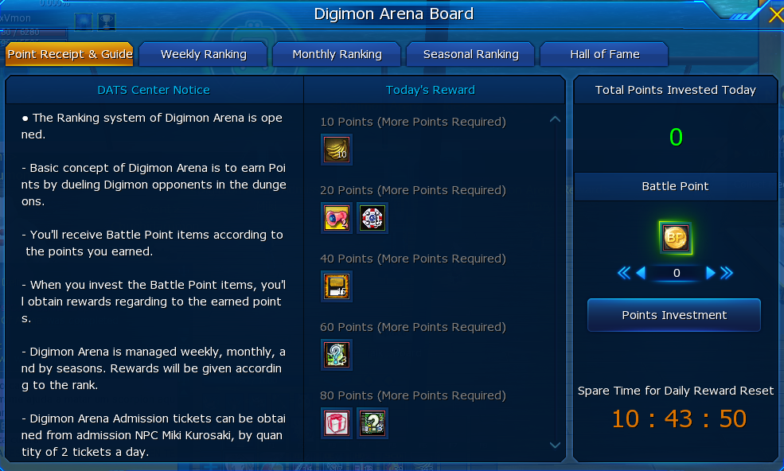

## 【增益效果BUFF】前言

| 评价指标 | 个人解释                                                                   |
| :------- | :------------------------------------------------------------------------ |
| 🔥🔥🔥   | 提升50%AT？提升100%SCD？这在前期几乎等于输出翻倍好吧。                         |
| 🍙🍙🍙  | 每天可以在竞技场兑换一套BUFF，银光湖的小古加兽也能获得SCD buff。地摊也有很多人卖 |
| 💎      | BUFF很便宜的，副本都能产出。                                                 |
|          | 不用看脸，实打实的提升。                                                     |

打不过小怪了，吃个BUFF；打不过BOSS了，吃个BUFF；打不过副本了，吃个BUFF。这个游戏因为数值崩坏的原因，即使是氪佬在推本时，也都在氪BUFF，没有BUFF就没有输出，所以尽情地氪吧！当然你最好先搞清楚BUFF的获取途径是什么，别破产了。综上所述，给出对萌新的推荐指数：⭐⭐⭐⭐⭐

## 1. 增益BUFF的种类

### 1.1 数码兽增幅器Digimon Boost

最常见的增益BUFF道具，就是数码兽增幅器Digimon Boost。

|                                      图标                                      |                   名称                    |       效果       | 持续时间 | 冷却时间 |     备注      |
| ----------------------------------------------------------------------------- | ---------------------------------------- | ---------------- | :------: | -------- | ------------- |
|            | Digimon Boost - [Attack] + 50%           | 基础AT+50%       |    1h    |          | 几乎都不可交易 |
|           | Digimon Boost - [Defense] + 50%          | 基础DE+50%       |    1h    |          | 几乎都不可交易 |
|            | Digimon Boost - [Max HP] + 50%           | 基础HP上限+50%    |    1h    |          | 几乎都不可交易 |
|            | Digimon Boost - [Max DS] + 50%           | 基础DS上限+50%    |    1h    |          | 几乎都不可交易 |
|     | Digimon Boost - [Skill Damage] + 100%    | 基础技能伤害+100% |    1h    | 15m      | 几乎都不可交易 |
|  | Digimon Boost - [Critical Attack] + 100% | 基础暴击伤害+100% |    1h    | 15m      | 几乎都不可交易 |
|        | Digimon Boost - [Skill Damage] + 50%     | 基础技能伤害+50%  |    1h    | 15m      | 几乎都不可交易 |
Digimon Boost - [Skill Damage] + 50%
> 注：备注中未特殊说明的道具，均为存在可交易的道具。

### 1.2 插入卡Plugin Card

这类BUFF十分稀少，市价较高，效果上和增幅器几乎完全相同。因为数码兽增幅器和插入卡是互斥的，所以也没人买。

|                             图标                              |           名称           |       效果       | 持续时间 | 冷却时间 | 备注 |
| ------------------------------------------------------------ | ----------------------- | ---------------- | :------: | -------- | ---- |
|                                                              |                         | 基础AT+50%       |    1h    |          |      |
|      | Plugin Card[DE]+50%     | 基础DE+50%       |    1h    |          |      |
|  | Plugin Card[HP Max]+50% | 基础HP上限+50%    |    1h    |          |      |
|  | Plugin Card[DS Max]+50% | 基础DS上限+50%    |    1h    |          |      |
|    | Plugin Card[SCD]+100%   | 基础技能伤害+100% |    1h    | 15m      |      |
|    | Plugin Card[CAT]+100%   | 基础暴击伤害+100% |    1h    | 15m      |      |
|                                                              |                         | 基础技能伤害+50%  |    1h    | 15m      |      |

> 注：未写的内容，是暂时在地摊上找不到现成的商品，无法考证。

### 1.3 四圣BUFF Grace of Challenge

四圣的祝福BUFF，打副本可掉落，效果强力，但是要求驯兽师等级必须大于等于70级。

|                                      图标                                      |                    名称                     |       效果       | 持续时间 | 冷却时间 |            备注            |
| ----------------------------------------------------------------------------- | ------------------------------------------ | ---------------- | :------: | :------: | ------------------------- |
|                | Grace of Challenge [AT] +50%               | 基础AT+50%       |    2h    |          |                           |
|            | Grace of Challenge [HP Max] +50%           | 基础HP上限+50%    |    2h    |          |                           |
|            | Grace of Challenge [DS Max] +50%           | 基础DS上限+50%    |    2h    |          |                           |
|                | Grace of Challenge [DE] +50%               | 基础DE+50%        |    2h    |          | 似乎只有青龙、黄龙副本会产出 |
|             | Grace of Challenge [EXP] +1000%            | 经验获得量+1000%  |    2h    |          |                           |
|     | Grace of Challenge [Skill Damage] +100%    | 基础技能伤害+100% |    2h    |   15m    |                           |
|  | Grace of Challenge [Critical Damage] +100% | 基础暴击伤害+100% |    2h    |   15m    |                           |
|                | Grace of Challenge [MS] +35%               | 移动速度+35%      |    2h    |    5m    |                           |

> 注：有时你能在地摊找到其他的四圣BUFF，但他们都可以在基地的蛋蛋兽处兑换成统一的BUFF，也就是Grace of Challenge。

### 1.4 经验EXP BUFF

练级是可以吃的经验加成BUFF。

|                                图标                                 |               名称               |              效果               |  持续时间  | 冷却时间 |      备注       |
| ------------------------------------------------------------------ | ------------------------------- | ------------------------------ | :-------: | :------: | --------------- |
|            | Amplification Booster           | 经验获得量+200%/300%/500%/1000% |    30m    |          | 新手礼包会送很多 |
|      | Super Amplification Booster     | 经验获得量+1000%                |    1h     |          |                 |
|            | Attribute EXP Booster           | 经验获得量+50%                  | 1d/7d/15d |          |                 |
|  | Grace of Challenge [EXP] +1000% | 经验获得量+1000%                |    2h     |          |                 |
|                     | Spicy Chilli                    | 经验获得量+1000%                |    1h     |    1h    |                 |

## 2. 增益BUFF的叠加

 - 不可叠加的BUFF，后吃的会覆盖前者的持续时间，无法同时独立生效。
 - 可叠加的BUFF，其数值累加。

### 2.1 普通BUFF

 - 前面提到的增幅器BUFF和插入卡BUFF，可以视为同一类BUFF。可以理解为它们本质是一样的，只是名字不一样，占你背包空间。
 - 增幅器中的AT和DE视为两个BUFF，可以同时生效，其他同理。
 - 增幅器的SCD存在两种数值，50%和100%，视为同一个BUFF，不可叠加。
 - 四圣BUFF和增幅器视为两种BUFF，可以叠加。**唯独SCD和CAT不可叠加。**
 - 多种类的四圣BUFF，例如白虎BUFF和朱雀BUFF，都与视为同一类BUFF，不可叠加。

### 2.2 经验BUFF

 - 通常来说，技能栏上方可以存放2个经验增益BUFF，它们一个可以来自经验增幅器，另一个可以来自四圣BUFF。
 - Amplification Booster和Super Amplification Booster视为同一个BUFF，不可叠加。
 - Attribute EXP Booster使用后将位于驯兽师BUFF栏中，可以与其他BUFF叠加。
 - 据说辣椒可以和其他BUFF叠加使用。

## 3. 获取方式

### 3.1 数码兽增幅器

 - 新手礼包
 - 每日竞技场投币80可兑换一套

 - 银光湖小古加兽每日任务，可获得50% SCD增幅器2个。

### 3.2 插入卡

 - 地摊

### 3.3 四圣BUFF

 - 打副本
 - 地摊

### 3.4 经验EXP BUFF

 - 打副本
 - 竞技场兑换
 - 地摊
 - 活动

