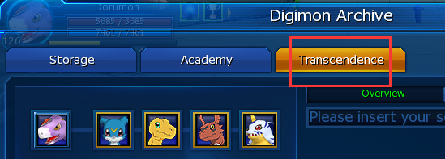
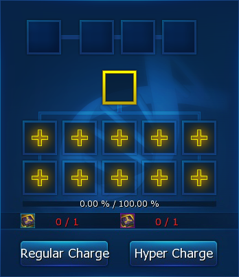

## 【数码兽超越】前言

| 评价指标 | 个人解释                                                                                              |
| :------- | :--------------------------------------------------------------------------------------------------- |
| 🔥       | 超越后的6阶宠，约能提升10%的数值。但是超越的时间通常较晚，在其他系统的加持下，超越带来的增幅不会那么明显。 |
| 🍙🍙    | 超越卡，自己去野外打材料。烂泥兽，等活动和日常任务来白嫖获得，都属于有时间就能获得的资源。                 |
| 💎💎    | 等不及了，要氪金，最贵的应该是5阶烂泥兽，价格波动较大，我也不好说。非常急要4阶宠，可能还要买备份。         |
|          | 完全没有概率因素，素材的要求也很明确且数量较少，所以完全不用看脸。                                       |

萌新度过了初期开荒，到达战力瓶颈，通过氪增益BUFF通常能进一步推进。此时萌新应该考虑，自己未来一段时间要用的主宠是哪个，进而准备超越素材。超越所带来的战力提升可以简单当做是10%，但是因为萌新还有其他衣服、首饰等属性加成，超越带来的体型数值提升完全不如初期5阶125%的那么明显了。并且超越所需的5阶烂泥十分稀缺，建议萌新多加考虑。综上所述，给出对萌新的推荐指数：⭐⭐

## 1. 数码兽的超越

本节将介绍，如何将5阶数码兽超越为6阶，并且6阶数码兽在哪些方面与5阶存在差异。关于5阶数码兽的体型，请阅读[【数码兽体型】](数码兽体型.md)。

**超越**是一个游戏的玩法/系统，可以提升数码兽的战力，超越后的数码兽阶级将变为6阶，获得如下优点：

 - 数码兽的体型上限从130%提升到了140%。
 - 解锁了[数码兽强化](数码兽强化.md)的HP选项。
 - 不再可以作为超越的素材。

超越后的6阶数码兽，将在体型上明显高于5阶数码兽。5阶的极限为130%，吃超级稀有的超级彩叶能达到135%。而6阶的极限为140%，吃常见的ygg都有概率能超过135%。二者的属性差异通常可以理解为10%。

除此之外，6阶宠解锁的HP强化选项，在15级极限强化HP的情况下，数码兽的HP将提升54%，这是5阶宠无法获得的提升。在游戏后期，打副本的唯一威胁就是BOSS的技能伤害，技能伤害无法通过DE、EV、BL进行减免，因此HP上限就是数码兽足够强的重要属性。

> 注：常规的3、4阶的数码兽是无论如何都不能超越为6阶的。孵化时非5阶的数码兽就是烂。

## 2. 数码兽的超越条件

数码兽必须满足以下条件才能进行超越：

 - 孵化时的阶级是5阶。（Variant类型数码兽和斗士类型数码兽除外）
 - 体型必须大于等于125%。
 - 数码兽的等级达到100级及以上。

## 3. 超越指南

你可以通过**Digimon Archive**机器，找到超越系统。

在左上方的携带槽中选择想要进行超越的数码兽，进度条就会显示出该数码兽的进度（经验值）。然后从右边仓库中选择素材数码兽（投喂后将消失）放置于左侧中间的栏目中，使用**常规充能**（Regular Charge）或**超级充能**（Hyper Charge）将该数码兽化为经验条。

之后只需要不断地投喂素材数码兽，投喂得到的经验取决于素材数码兽的等级、强化等级、阶级。在选择素材数码兽时，能提前观察到其可以提供的进度。每一个素材数码兽都需要使用一个**超越卡**（超越芯片）。常规充能需要消耗**低级超越卡**，超级充能需要消耗**中级超越卡**。携带槽中选择的是龙型数码兽，则充能需要消耗的是**龙型超越卡**，如果是兽型数码兽，则需要消耗的是**兽型超越卡**。

> tips：每次点击充能时，都有较低概率获得2倍进度哦。

当进度条达到100%时，就可以进行超越，使用5T作为超越成本，即可得到6阶的数码兽。详细的操作步骤，请阅读[【附录F：强化爱宠，超它！】](../2.新手指导/附录F：强化爱宠，超它！.md)。

例如，我们要超越1只兽型数码兽多路兽，则我们需要准备1只任意4阶素材数码兽、1只4阶烂泥兽 和1只5阶烂泥兽 ，1张兽低超越卡和2张兽中超越卡即可。

超越后的数码兽，将不能再使用改变体型的叶子（实际上也是果实，习惯叫叶子），而是改为使用6阶超越宠专属的水果：

|                               图标                               |                    名称                    |            效果            |
| --------------------------------------------------------------- | ----------------------------------------- | ------------------------- |
|    | **ygg**，Fruit of Yggdrasil（世界树的果实） | 将体型随机修改为125%-140%。 |
|  | Fruit of Homeostasis（体内平衡的果实）      | 将体型随机修改为128%-140%。 |

从5阶超越为6阶，其实没有获得任何的属性提升。超越后，吃果实来提升体型获得增强吧，体型目标一般是**135%**。

> tips：两只体型均为135.00%的加布兽，一只是4阶一只是6阶，则他们的属性数值完全相同。

## 4. 超越素材数码兽提供的经验

超越素材数码兽，也指狗粮，都将成为6阶数码兽的经验宝宝。

### 4.1 超越经验公式

素材提供的经验公式：(强化等级*5 + 等级 + 250) * 阶级评分 * 超越卡倍率 / 1400 = 经验百分比

1. **强化等级**：即为该素材数码兽的强化等级。当做狗粮的数码兽，通常也不会去练它，强化等级一般为0。

2. **等级**：即为该素材数码兽的当前等级。当做狗粮的数码兽，通常也不会去练它，等级一般为1。

3. **阶级评分**通过以下表格得出：

| 素材数码兽的阶级 | 不同种类素材 | 同种类素材 |
| :-------------: | :---------: | :-------: |
|       3阶       |      1      |     3     |
|       4阶       |     10      |    30     |
|       5阶       |     40      |    120    |

4. **超越卡倍率**：在超越时，如果使用的是常规充能，消耗低超越卡，则为1。如果使用的是超级充能，消耗中超越卡，则为1.6。

还有一些对该公式的细节解释：

 - 在上述公式中，只取到小数点后2位，第3位四舍五入。（例如等级75的5阶杂宠，将给出(0 + 75 + 250) * 40 * 1 / 1400 = 9.285714 ≈9.29，所以这只数码兽作为素材将提供9.29%的进度值）
 - 强化等级每5级划分一个区间。例如强化等级1和强化等级2所代入的强化等级是相同的。（未证实）
 - 宠物等级每1级划分一个区间。例如等级1和等级2的狗粮所代入的等级是不同的。
 - 完成一只6阶超越，需要得到100%的进度，即为140000的经验。
 - 由阶级评级可看出，假如我要超越一只多路兽，如果我使用的素材数码兽也是多路兽，将获得3倍的进度提升。而如果素材数码兽是加布兽，则只有正常的进度提升。
 - 超越卡分为低级超越卡和中级超越卡。中级卡十分珍贵，但能带来1.6倍的进度提升。

### 4.2 烂泥兽提供的经验值：

**烂泥兽**是一种官方设定的特殊数码兽。不论烂泥兽的等级和克隆等级为多少，它总是提供固定的大量经验，是最佳的经验宝宝。

| 烂泥兽的阶级 | 常规充能 | 超级充能 |
| :----------: | :------: | :------: |
|      3       |   2.24   |   3.58   |
|      4       |  16.82   |  26.91   |
|      5       |  44.85   |  71.76   |

这样，我们就能发现，使用任意1只4阶宠+1只4阶烂泥兽+1只5阶烂泥兽，第一只使用常规充能，两只烂泥兽使用超级充能，就能获得7.17+26.91+71.76=105.84>100，即可攒满进度条，从而完成超越。

### 4.3 素材数码兽（5阶）提供的经验值：

 
|  | 强化 0 | 强化 5 | 强化10 | 强化15 | 强化20 | 强化25 | 强化30 | 强化35 | 强化40 | 强化45 | 强化50 | 强化55 | 强化60 | 强化65 | 强化70 | 强化75 |
| :-------------------------------------------------------: | -----: | -----: | -----: | -----: | -----: | -----: | -----: | -----: | -----: | -----: | -----: | -----: | -----: | -----: | -----: | -----: |
|                          等级  1                           |   7.17 |   7.89 |   8.60 |   9.31 |  10.03 |  10.74 |  11.46 |  12.17 |  12.89 |  13.60 |  14.31 |  15.03 |  15.74 |  16.46 |  17.17 |  17.89 |
|                          等级 10                           |   7.43 |   8.14 |   8.86 |   9.57 |  10.29 |  11.00 |  11.71 |  12.43 |  13.14 |  13.86 |  14.57 |  15.29 |  16.00 |  16.71 |  17.43 |  18.14 |
|                          等级 20                           |   7.71 |   8.43 |   9.14 |   9.86 |  10.57 |  11.29 |  12.00 |  12.71 |  13.43 |  14.14 |  14.86 |  15.57 |  16.29 |  17.00 |  17.71 |  18.43 |
|                          等级 30                           |   8.00 |   8.71 |   9.43 |  10.14 |  10.86 |  11.57 |  12.29 |  13.00 |  13.71 |  14.43 |  15.14 |  15.86 |  16.57 |  17.29 |  18.00 |  18.71 |
|                          等级 40                           |   8.29 |   9.00 |   9.71 |  10.43 |  11.14 |  11.86 |  12.57 |  13.29 |  14.00 |  14.71 |  15.43 |  16.14 |  16.86 |  17.57 |  18.29 |  19.00 |
|                          等级 50                           |   8.57 |   9.29 |  10.00 |  10.71 |  11.43 |  12.14 |  12.86 |  13.57 |  14.29 |  15.00 |  15.71 |  16.43 |  17.14 |  17.86 |  18.57 |  19.29 |
|                          等级 60                           |   8.86 |   9.57 |  10.29 |  11.00 |  11.71 |  12.43 |  13.14 |  13.86 |  14.57 |  15.29 |  16.00 |  16.71 |  17.43 |  18.14 |  18.86 |  19.57 |
|                          等级 70                           |   9.14 |   9.86 |  10.57 |  11.29 |  12.00 |  12.71 |  13.43 |  14.14 |  14.86 |  15.57 |  16.29 |  17.00 |  17.71 |  18.43 |  19.14 |  19.86 |
|                          等级 80                           |   9.43 |  10.14 |  10.86 |  11.57 |  12.29 |  13.00 |  13.71 |  14.43 |  15.14 |  15.86 |  16.57 |  17.29 |  18.00 |  18.71 |  19.43 |  20.14 |
|                          等级 90                           |   9.71 |  10.43 |  11.14 |  11.86 |  12.57 |  13.29 |  14.00 |  14.71 |  15.43 |  16.14 |  16.86 |  17.57 |  18.29 |  19.00 |  19.71 |  20.43 |
|                          等级100                           |  10.00 |  10.71 |  11.43 |  12.14 |  12.86 |  13.57 |  14.29 |  15.00 |  15.71 |  16.43 |  17.14 |  17.86 |  18.57 |  19.29 |  20.00 |  20.71 |
|                          等级110                           |  10.29 |  11.00 |  11.71 |  12.43 |  13.14 |  13.86 |  14.57 |  15.29 |  16.00 |  16.71 |  17.43 |  18.14 |  18.86 |  19.57 |  20.29 |  21.00 |
|                          等级120                           |  10.57 |  11.29 |  12.00 |  12.71 |  13.43 |  14.14 |  14.86 |  15.57 |  16.29 |  17.00 |  17.71 |  18.43 |  19.14 |  19.86 |  20.57 |  21.29 |
|                          等级130                           |  10.86 |  11.57 |  12.29 |  13.00 |  13.71 |  14.43 |  15.14 |  15.86 |  16.57 |  17.29 |  18.00 |  18.71 |  19.43 |  20.14 |  20.86 |  21.57 |

### 4.4 素材数码兽（4阶）提供的经验值：

|  | 强化 0 | 强化 5 | 强化10 | 强化15 | 强化20 | 强化25 | 强化30 | 强化35 | 强化40 | 强化45 | 强化50 | 强化55 | 强化60 | 强化65 | 强化70 | 强化75 |
| :-------------------------------------------------------: | -----: | -----: | -----: | -----: | -----: | -----: | -----: | -----: | -----: | -----: | -----: | -----: | -----: | -----: | -----: | -----: |
|                          等级  1                           |   1.79 |   1.97 |   2.15 |   2.33 |   2.51 |   2.69 |   2.86 |   3.04 |   3.22 |   3.40 |   3.58 |   3.76 |   3.94 |   4.11 |   4.29 |   4.47 |
|                          等级 10                           |   1.86 |   2.04 |   2.21 |   2.39 |   2.57 |   2.75 |   2.93 |   3.11 |   3.29 |   3.46 |   3.64 |   3.82 |   4.00 |   4.18 |   4.36 |   4.54 |
|                          等级 20                           |   1.93 |   2.11 |   2.29 |   2.46 |   2.64 |   2.82 |   3.00 |   3.18 |   3.36 |   3.54 |   3.71 |   3.89 |   4.07 |   4.25 |   4.43 |   4.61 |
|                          等级 30                           |   2.00 |   2.18 |   2.36 |   2.54 |   2.71 |   2.89 |   3.07 |   3.25 |   3.43 |   3.61 |   3.79 |   3.96 |   4.14 |   4.32 |   4.50 |   4.68 |
|                          等级 40                           |   2.07 |   2.25 |   2.43 |   2.61 |   2.79 |   2.96 |   3.14 |   3.32 |   3.50 |   3.68 |   3.86 |   4.04 |   4.21 |   4.39 |   4.57 |   4.75 |
|                          等级 50                           |   2.14 |   2.32 |   2.50 |   2.68 |   2.86 |   3.04 |   3.21 |   3.39 |   3.57 |   3.75 |   3.93 |   4.11 |   4.29 |   4.46 |   4.64 |   4.82 |
|                          等级 60                           |   2.21 |   2.39 |   2.57 |   2.75 |   2.93 |   3.11 |   3.29 |   3.46 |   3.64 |   3.82 |   4.00 |   4.18 |   4.36 |   4.54 |   4.71 |   4.89 |
|                          等级 70                           |   2.29 |   2.46 |   2.64 |   2.82 |   3.00 |   3.18 |   3.36 |   3.54 |   3.71 |   3.89 |   4.07 |   4.25 |   4.43 |   4.61 |   4.79 |   4.96 |
|                          等级 80                           |   2.36 |   2.54 |   2.71 |   2.89 |   3.07 |   3.25 |   3.43 |   3.61 |   3.79 |   3.96 |   4.14 |   4.32 |   4.50 |   4.68 |   4.86 |   5.04 |
|                          等级 90                           |   2.43 |   2.61 |   2.79 |   2.96 |   3.14 |   3.32 |   3.50 |   3.68 |   3.86 |   4.04 |   4.21 |   4.39 |   4.57 |   4.75 |   4.93 |   5.11 |
|                          等级100                           |   2.50 |   2.68 |   2.86 |   3.04 |   3.21 |   3.39 |   3.57 |   3.75 |   3.93 |   4.11 |   4.29 |   4.46 |   4.64 |   4.82 |   5.00 |   5.18 |
|                          等级110                           |   2.57 |   2.75 |   2.93 |   3.11 |   3.29 |   3.46 |   3.64 |   3.82 |   4.00 |   4.18 |   4.36 |   4.54 |   4.71 |   4.89 |   5.07 |   5.25 |
|                          等级120                           |   2.64 |   2.82 |   3.00 |   3.18 |   3.36 |   3.54 |   3.71 |   3.89 |   4.07 |   4.25 |   4.43 |   4.61 |   4.79 |   4.96 |   5.14 |   5.32 |
|                          等级130                           |   2.71 |   2.89 |   3.07 |   3.25 |   3.43 |   3.61 |   3.79 |   3.96 |   4.14 |   4.32 |   4.50 |   4.68 |   4.86 |   5.04 |   5.21 |   5.39 |

### 4.5 素材数码兽（3阶）提供的经验值：

|  | 强化 0 | 强化 5 | 强化10 | 强化15 | 强化20 | 强化25 | 强化30 | 强化35 | 强化40 | 强化45 | 强化50 | 强化55 | 强化60 | 强化65 | 强化70 | 强化75 |
| :-------------------------------------------------------: | -----: | -----: | -----: | -----: | -----: | -----: | -----: | -----: | -----: | -----: | -----: | -----: | -----: | -----: | -----: | -----: |
|                          等级  1                           |   0.18 |   0.20 |   0.21 |   0.23 |   0.25 |   0.27 |   0.29 |   0.30 |   0.32 |   0.34 |   0.36 |   0.38 |   0.39 |   0.41 |   0.43 |   0.45 |
|                          等级 10                           |   0.19 |   0.20 |   0.22 |   0.24 |   0.26 |   0.28 |   0.29 |   0.31 |   0.33 |   0.35 |   0.36 |   0.38 |   0.40 |   0.42 |   0.44 |   0.45 |
|                          等级 20                           |   0.19 |   0.21 |   0.23 |   0.25 |   0.26 |   0.28 |   0.30 |   0.32 |   0.34 |   0.35 |   0.37 |   0.39 |   0.41 |   0.42 |   0.44 |   0.46 |
|                          等级 30                           |   0.20 |   0.22 |   0.24 |   0.25 |   0.27 |   0.29 |   0.31 |   0.33 |   0.34 |   0.36 |   0.38 |   0.40 |   0.41 |   0.43 |   0.45 |   0.47 |
|                          等级 40                           |   0.21 |   0.23 |   0.24 |   0.26 |   0.28 |   0.30 |   0.31 |   0.33 |   0.35 |   0.37 |   0.39 |   0.40 |   0.42 |   0.44 |   0.46 |   0.47 |
|                          等级 50                           |   0.21 |   0.23 |   0.25 |   0.27 |   0.29 |   0.30 |   0.32 |   0.34 |   0.36 |   0.38 |   0.39 |   0.41 |   0.43 |   0.45 |   0.46 |   0.48 |
|                          等级 60                           |   0.22 |   0.24 |   0.26 |   0.28 |   0.29 |   0.31 |   0.33 |   0.35 |   0.36 |   0.38 |   0.40 |   0.42 |   0.44 |   0.45 |   0.47 |   0.49 |
|                          等级 70                           |   0.23 |   0.25 |   0.26 |   0.28 |   0.30 |   0.32 |   0.34 |   0.35 |   0.37 |   0.39 |   0.41 |   0.42 |   0.44 |   0.46 |   0.48 |   0.50 |
|                          等级 80                           |   0.24 |   0.25 |   0.27 |   0.29 |   0.31 |   0.33 |   0.34 |   0.36 |   0.38 |   0.40 |   0.41 |   0.43 |   0.45 |   0.47 |   0.49 |   0.50 |
|                          等级 90                           |   0.24 |   0.26 |   0.28 |   0.30 |   0.31 |   0.33 |   0.35 |   0.37 |   0.39 |   0.40 |   0.42 |   0.44 |   0.46 |   0.47 |   0.49 |   0.51 |
|                          等级100                           |   0.25 |   0.27 |   0.29 |   0.30 |   0.32 |   0.34 |   0.36 |   0.38 |   0.39 |   0.41 |   0.43 |   0.45 |   0.46 |   0.48 |   0.50 |   0.52 |
|                          等级110                           |   0.26 |   0.28 |   0.29 |   0.31 |   0.33 |   0.35 |   0.36 |   0.38 |   0.40 |   0.42 |   0.44 |   0.45 |   0.47 |   0.49 |   0.51 |   0.53 |
|                          等级120                           |   0.26 |   0.28 |   0.30 |   0.32 |   0.34 |   0.35 |   0.37 |   0.39 |   0.41 |   0.42 |   0.44 |   0.46 |   0.48 |   0.50 |   0.51 |   0.53 |
|                          等级130                           |   0.27 |   0.29 |   0.31 |   0.33 |   0.34 |   0.36 |   0.38 |   0.40 |   0.41 |   0.43 |   0.45 |   0.47 |   0.49 |   0.50 |   0.52 |   0.54 |

## 5. 获取方式

### 5.1 4阶数码兽的获取方式

 - 古加兽每日任务
 - 蓝蛋/金蛋等硬孵4阶
 - 地摊
 - 活动
 - 商城

### 5.2 超越卡的获取方式

 - 彩虹桥副本，开箱子有几率获得随机种类中超越卡。后续再修正。。。
 - 基地的分子兽，可以制作。[3个龙中卡+5个数码核+49M]=1个龙低超越卡。其他种类可类推。
 - 地摊
 - 商城

### 5.3 烂泥兽的获取方式

 - 地摊
 - 活动

### 5.4 果实的获取方式

 - 副本，好像都掉。。。后续再修正。。。
 - 地摊
 - 活动
 - 商城

