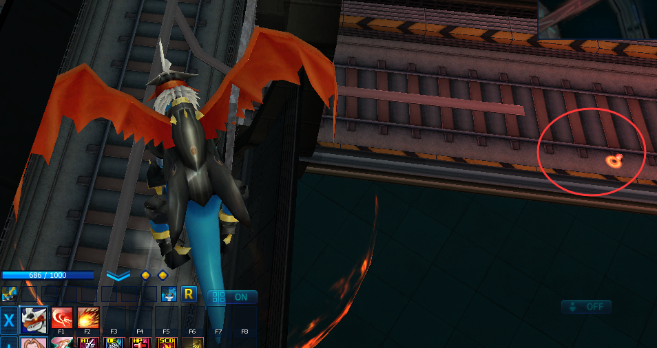

## 【其他-地下广场的虫虫兽】前言

即使是在地下的废墟之中，地下广场仍然十分热闹。驯兽师使用MC卡，召唤了大量数码兽一起来开Party，然后随着一声F3的呼啸，一切都化为了灰烬，广场又再次沉寂下来，只能听到寂静的、徘徊的脚步声。

但人们始终知道，在这个人来人往的地下广场之外，有一只孤独的虫虫兽，鲜有人见过它的身影。。。

## 1. 定位目标——虫虫兽

从基地进入召唤数码兽的地下广场，打开游戏中的地图，我们能在怪物列表中发现一只1级的虫虫兽。

但是点击这只虫虫兽，不能给我们任何路线指引到它。使用脚本的打怪功能，也能在游戏上方指向虫虫兽，但是脚本并不能找到有效的路径去攻击它。

那么它究竟在哪呢？

## 2. 突破界限

来到地下广场的地铁大门处。这个铁门是锁着的，玩家无法出去。

我们来到大门的墙根下，用数码兽为主视角，将其走入该墙角处。

然后让该数码兽进化为体型较大的数码兽，例如合体进化，通常体型较大。我们这里合体进化为了帝皇龙甲兽，可以发现我们的视角，直接抬升了许多，并且可以穿墙看到外围的区域。

此时，我们点击下图中的红色圆圈附近，便可以获得一个红色路标，这意味着存在一条路径可以让我们出去

于是我们就出来了。

然后就可以在地铁外围移动，寻找虫虫兽，最终我们可以在地图西北方向找到它。弱小、无助，而且没有掉落物。

## 3. 安全返回

人是出来了，但是怎么回去呢？那个铁门依旧是锁着的。第一个简单的方法，就是直接下线，重新登，这样我们就会被传送回基地。

下面我们发现了另外一个可用的返回方法。首先同样是找到铁门的边框墙角处，让数码兽靠近墙角。

之后再进化为体型大的数码兽，并转移视角，让视角可以穿墙看到里面的通道，然后点击红色圈附近的区域，又能找到一个红色路标，让我们走回去。这一步骤可能需要多次尝试，因为视角切换的角度，可能点不出红色路标，请多加尝试。

有的时候，驯兽师可以随着数码兽一起穿墙走过来，有时候就会出现下面这样的“人兽分离”。

## 4. 额外的尝试

除了第二节的内容，还有一个不需要切换穿墙视角来过图的方法。在白棋兽旁边，都是废墟的碎片，但是顶部是有空间的。让数码兽靠近下图的红色角落处。

然后在角落进化为体型大的个体，这样我们的视角就能看到对面的广场空地区域的。直接点击，就能获得一个红色路标。然后我们的数码兽就能自动找到穿越铁门的路径，出去找虫虫兽了。

## 5. 致谢

感谢[三尺]提供的解法。
